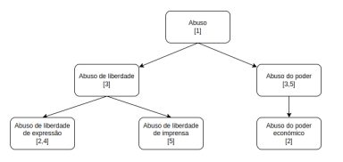

Relatório EW
============

Introdução
----------

Este relatório tem como objetivo apresentar os resultados obtidos no desenvolvimento do projeto de Engenharia Web que tem como tema um Sistema de Gestão de Bases de Dados de Acordãos. O objetivo principal deste trabalho passa por conciliar os documentos JSON fornecidos, unificando-os numa única base de dados unificada, fornecendo ao utilizador uma interface de consulta e pesquisa de acordãos. Neste relatório, serão apresentadas as decisões tomadas ao longo do desenvolvimento do projeto, bem como as tecnologias utilizadas e as dificuldades encontradas.

Análise e Levantamento de Requisitos
------------------------------------

Numa primeira fase, o grupo realizou a análise do contexto e do âmbito do projeto, adquirindo conhecimento da área através de conversas com peritos e utilizadores do sistema. Isto permitiu-nos aprender o vocabulário utilizado e averiguar quais os aspetos que poderiam ser melhorados. Com base nos objetivos/requisitos definidos pelo cliente e com base em novos requisitos identificados pelo grupo, elaboramos a seguinte lista de requisitos funcionais do sistema, subdividida em níveis de utilização:

### ROLE: Consumidor

* Consultar os acordãos disponíveis na BD, agrupados por tribunal;
* Filtrar e realizar pesquisas nos acordãos disponibilizados quer globalmente quer por tribunal;
* Ordenar os resultados com base em diferentes critérios;
* Adicionar e remover acordãos aos favoritos, adicionando descrições, se pretendido;
* Consultar o histórico recente de consultas;

### ROLE: Produtor

* Aceder às funcionalidades do consumidor;
* Adicionar/remover/editar registos por si criados;

### ROLE: Administrador

* Aceder às funcionalidades do consumidor;
* Adicionar/remover/editar qualquer registo do sistema;
* Carregar ficheiros JSON de acordãos para a(s) base(s) de dados.

Abrangendo todos os níveis de acesso, acrescenta-se ainda a necessidade de autenticação para o uso completo do sistema. Aqui destacam-se a possibilidade de registo/autenticação com username+password, conta Google ou conta Facebook.

Concepção e Desenvolvimento da solução
--------------------------------------

### Tratamento da Base de Dados

Um dos primeiros passos dados no desenvolvimento da solução foi o da unificação dos campos de todas as bases de dados. Tendo exportado para ficheiro um objeto que relaciona-se cada campo com a contagem de registos que o possuem por meio de uma script Javascript, observamos a existência de mais de 10000 campos diferentes. Assim, foi necessário realizar uma análise cuidada de cada campo, verificando se este poderia ser unificado com outro campo ou até mesmo removido. Com a ajuda do portal [http://www.dgsi.pt/home.nsf?OpenDatabase](http://www.dgsi.pt/home.nsf?OpenDatabase), identificamos grande parte dos campos como sendo originários de tabelas existentes em textos. Descartando esses campos, uma vez que não é possível tratá-los, reduzimos a lista de campos para pouco mais de 100. A partir daqui, foi necessário analisar o significado de cada campo e verificar se este poderia ser unificado com outro campo. Foi uma tarefa morosa, uma vez que requereu a consulta dos valores de cada campo em cada base de dados. Para além disso, alguns campos foram reduzidos a listas. Por exemplo, Área Temática e Área Temática 1 foram unificados numa lista de áreas temáticas. Listam-se então algumas unificações realizadas:

| Campos | Unificação |
| -- | -- |
| Recorrido 1/Recorrido 2 | Recorridos |
| Área Temática/Área Temática 1/Área Temática 2 | Áreas Temática |
| Referência de Publicação/Referência Publicação 1/Referência Publicação 2 | Referências de Publicação |
| Normas Julgadas Inconst./Normas Declaradas Inconst. | Normas Declaradas Inconst. |
| Secção/Juízo ou Secção | Juízo ou Secção |

De notar que alguns campos que, à primeira vista, pareciam unificáveis (como 'Data do Acordão' e 'Data da Decisão Singular'), não o o foram por apresentarem significado ligeiramente diferente. Um acordão implica um acordo entre pelo menos 2 juízes, enquanto que uma decisão Singular é tomada por apenas um magistrado.

Para além dos campos identificados, foram adicionados outros campos no modelo de um acordão do _mongoose_. O campo _id_ é um campo obrigatório, que identifica cada acordão de forma única. Este campo é autoincrementado sempre que inserimos um novo registo na BD. Numa retrospetiva do projeto, este campo poderia ter sido substituído um id criado pelo próprio mongoDB, uma vez que este é mais eficiente e não requer controlo por parte do programador. Por fim, o campo _ProducerId_ tem como finalidade mapear cada registo ao produtor que eventualmente o criou.

### Autenticação

Paralelamente ao processo de tratamento dos dados, foi elaborado o serviço de autenticação. Este tem como objetivo permitir aos utilizadores autenticarem-se e registarem-se na aplicação com diferentes níveis de acesso. A coleção dos utilizadores é formada por documentos com os seguintes campos: username, password, name, surname, email, level (Nível de acesso, ou seja Consumidor, Produtor ou Administrador), active (Indica se o utilizador está ativo ou não), dateCreated, dateLastAccess, providerId (Identificador fornecido pelo google ou facebook), provider (Google ou Facebook), history (Lista de ids de processos visitados recentemente), favorites (Lista de pares (processo, descrição) que constituem os favoritos).

Conceptualmente, este serviço é uma API para a coleção _users_ da base de dados. Assim, deverá fornecer as seguintes rotas:

| Rota | Descrição |
| -- | -- |
| GET /users | Devolve todos os utilizadores da BD |
| GET /users/facebook | Inicia o processo de autenticação com o facebook |
| GET /users/google | Inicia o processo de autenticação com o google |
| GET /users/:id/history | Devolve o histórico do utilizador passado por parâmetro |
| GET /users/:id/favorites | Devolve os favoritos do utilizador passado por parâmetro |
| GET /users/:id | Devolve um utilizador |
| POST /users | Adiciona um utilizador à BD (requer autenticação) |
| POST /users/register | Adiciona um utilizador à BD (não requer autenticação) |
| POST /users/login | Autentica um utilizador |
| PUT /users/:id | Altera um utilizador na BD |
| PUT /users/:id/desativar | Desativa a conta de um utilizador |
| PUT /users/:id/ativar | Reativa a conta de um utilizador |
| PUT /users/:email/redefinePassword | Altera a password de um utilizador |
| PUT /users/:id/history | Adiciona um processo ao histórico do utilizador |
| PUT /users/:id/favorites | Adicionar um processo aos favoritos, juntamente com a descrição |
| PUT /users/:id/removeFavorite | Remove um processo dos favoritos |
| DELETE /users/:id | Remove um utilizador da BD |

Tal como acontecerá na API, várias destas rotas deverão estar protegidas e para isso o serviço de autenticação possui dois pontos importantes:
o momento do login e do registo. Neste serviço, no momento do registo, usamos o package 'passport' para nos auxiliar e fazer o registo na base de dados
mongo. Já no login também utilizámos o mesmo, o qual faz autenticação com o username e password.
Depois de iniciar sessão, o serviço responde com um json web token gerado para ser usado na nossa
aplicação (consultas à API de dados e acesso a páginas restritas).

Por outro lado, a nossa aplicação permite a autenticação com o google e com o facebook. Nos dois casos
usamos pacotes do passport e definimos uma estratégia que se aplica aos dois métodos.
A estratégia passa por, depois que o utilizador realizar a autenticação no site do google ou facebook, verificar 
se o utilizador em questão já pertence à base de dados com os campos providerId e provider e se o email associado já está em uso.
Caso não esteja inserido na base de dados, criámos um utilizador e gerámos um token para ser usado na nossa aplicação, este criado na rota de callback deste processo de autenticação.

### API

Genericamente, uma API é uma peça de software que fornece funcionalidade sobre um serviço. Na nossa aplicação, a API REST permite-nos aceder à(s) base(s) de dados, fornecendo métodos para a realização de operações CRUD na coleção dos acordãos da BD. A seguir listam-se algumas das rotas disponíveis:

| Rota | Descrição |
| -- | -- |
| GET /api/acordaos | Devolve todos os acordãos da BD, com base na _querystring_ |
| GET /api/acordaos/tribunais | Devolve todos os tribunais da BD, juntamente com a designação para a sua sigla |
| GET /api/acordaos/:id | Devolve o acordão com o id passado por parâmetro |
| GET /api/acordaos/apensos/:n_processo | Devolve os acordãos com o respetivo número de processo |
| GET /api/currentId | Devolve o próximo id a ser usado na BD |
| GET /postFile/:file_name | Ordena o envio de um ficheiro JSON para a BD |
| POST /api/acordaos | Adiciona um novo acordão à BD |
| PUT /api/acordaos/:id | Atualiza um acordão na BD |
| DELETE /api/acordaos/:id | Elimina um acordão da BD |

Relativamente à primeira rota (/api/acordaos) esta pode ser complementada com uma query string com os seguintes parâmetros:

* page=\`valor\` - indica que página de resultados pretendemos obter;
* limit=\`valor\` - indica o limite de acordãos em cada página;
* livre=\`termo\` - indica a pesquisa livre pelo termo indicado;
* descritor=\`termo\` - indica a pesquisa por um termo na taxonomia de descritores;
* campo=\`valor\` - indica que pretendemos filtrar os acordãos com um determinado valor em certo campo.

Relativamente à paginação, importa referir que o resultado da rota /api/acordaos devolve um object JSON com os seguintes campos:

* results - a lista de resultados obtida;
* previous - número e limites da página anterior;
* next - número e limites da página seguinte.

#### Pesquisas

Uma primeira abordagem ao problema das pesquisas consistiu na nossa própria implementação da pesquisa em formato "Texto Livre" e da pesquisa na taxonomia de descritores.

A taxonomia de descritores foi implementada como uma árvore de termos, em que estes são dispostos de forma hierárquica, de modo que nos ramos superiores da árvore encontram-se termos mais gerais e nos ramos inferiores termos relativos a descritores mais específicos. O critério de separação dos termos foi a existência de contectores sintáticos como proposições (simples ou contraídas) ou determinantes. Por exemplo, consideremos o seguinte mapeamento de descritores:

Abuso - 1
Abuso de liberdade - 3
Abuso de liberdade de expressão - 2,4
Abuso de liberdade de imprensa - 5
Abuso do poder - 3,5
Abuso do poder económico - 2
                

Nexte contexto, uma pesquisa nesta árvore pelo descritor "Abuso de liberdade" devolveria os processos 2,3,4 e 5.

Relativamente à pesquisa livre, pretendíamos ser capazes de mapear, para cada palavra encontrada, os registos onde esta aparecia, criando um dicionário de palavras-chave. Apesar de eficaz, esta abordagem tornou-se ineficiente dada a enorme quantidade de registos e, por conseguinte, de palavras. Assim, optamos por utilizar uma ferramenta externa, o Algolia, que nos permite realizar pesquisas em texto livre de uma forma bem mais otimizada, recorrendo a uma base de dados externa.

#### Integração com o Algolia

A base de dados de suporte a esta ferramenta daria suporte às operações de pesquisa e, como tal, deverá estar 100% concordante com a base de dados principal, em mongoDB. Assim, para cada operação de alteração de dados na base de dados principal, deverá ser realizada uma operação equivalente na base de dados da Algolia.

Um dos maiores desafios encontrados nesta fase deveu-se às restrições impostas por este serviço quanto ao tamanho dos registos. Pelo facto de, na versão gratuíta, os registos não poderem ultrapassar os 10Kb, foi necessário realizar a divisão dos mesmos em registos mais pequenos. Por consequência, nas operações de consulta, será necessário realizar a junção dos registos.

Este mecanismo foi particularmente relevante aquando do envio de ficheiros JSON para a base de dados. Dada a dimensão de alguns destes ficheiros, a leitura dos mesmos para memória de forma integral não foi possível, pelo que recorremos à biblioteca _stream-json_ para ler os registos de acordãos em forma de _stream_. Para realizar esta operação de forma ainda mais eficiente, outra estratégia usada foi a de envio de registos em _batches_.

### Interface

A interface é o serviço que expõe as páginas que o cliente pode aceder para interagir com o sistema. As páginas devem, por isso, facilitar o cliente nesse processo. Para tal, a interface deve ser intuitiva e de fácil utilização. O processo de desenvolvimento deste serviço começou pela elaboração de alguns mockups e pelo mapa de navegação que se apresenta no repositório do projeto, na diretoría _ResourcesRelatorio_.

A estrutura das páginas e o seu conteúdo foi realizada em _pug_ e estilizada com templates _bootstrap_. Finalmente, foi adicionada alguma funcionalidade adicional com o uso de código Javascript.

Para cada página foi adicionada uma rota específica, tal como podemos ver na tabela seguinte:

| Rota | Página |
| -- | -- |
| GET / | Página principal/Tribunais |
| GET /pesquisas | Página de pesquisas geral |
| GET /acordaos | Página com os acordãos (pode conter querystring) |
| GET /acordaos/:id | Página do acordão |
| GET /acordaos/novo | Formulário de inserção de um novo acordão |
| GET /acordaosProducer/:id | Página com os acordãos de um certo produtor |
| GET /acordaos/edit/:id | Página de edição de um acordão |
| GET /users/login | Formulário de autenticação |
| GET /users/register | Página de registo |
| GET /users/resetPassword | Página de reposição de password |
| GET /users/:id | Página do Perfil do utilizador |
| GET /users/history/:id | Página com o histórico do utilizador |
| GET /users/favourites/:id | Página com os favoritos do utilizador |
| GET /acordaos/delete/:id | Remoção de um acordão |
| POST /files | Envio de um ficheiro JSON |
| POST /description/:user\_id/:acordao\_id | Consumidor adicionou uma descrição a um acordão |
| POST /acordaos/novo | Envio de um novo acordão |
| POST /acordaos/edit | Envio da edição de um acordão |

Manual de utilização da aplicação
---------------------------------

Como forma de facilitar o arranque da aplicação, foi elaborado um ficheiro _docker-compose.yml_ responsável por criar e orquestrar os serviços que suportam a aplicação em diferentes _docker containers_. As portas de funciomento de cada serviço são as seguintes:

| Serviço | Porta |
| -- | -- |
| API | 8001 |
| Autenticação | 8002 |
| Interface | 8003 |
| MongoDB | 27017 |

Para iniciar a aplicação, basta executar o seguinte comando na pasta raiz do projeto: docker compose build seguido de docker compose up.

Em seguida, abrindo um _browser_ e inserindo o url 'localhost:8003' ter-se-á acesso à página principal da aplicação.

Conclusão
---------

Em suma, neste projeto pudemos realmente aprender como se constrói uma aplicação _web_ assente em vários microserviços que se articulam entre si para fornecer um serviço único para o cliente. Durante o processo de desenvolvimento, deparámo-nos com algumas dificuldades como a necessidade de articulação entre duas bases de dados. Contudo, acreditamos que as dificuldades foram ultrapassadas com sucesso, o que contribuiu para que fossem atingidos todos os objetivos estipulados para o projeto.